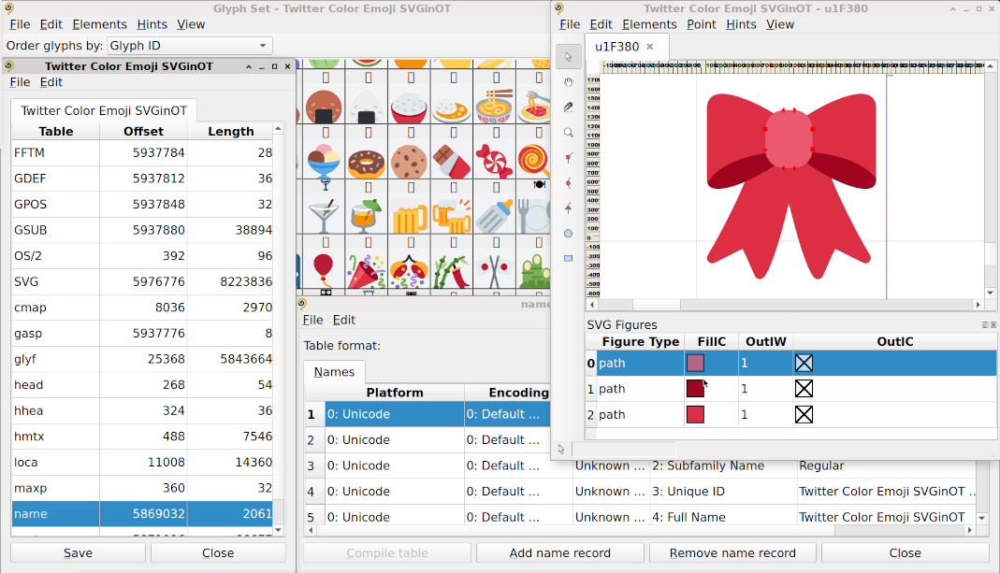

# FontShepherd -- OpenType font table editor/viewer

FontShepherd is an OpenType font table editor/viewer, inspired by the
Mensis tool, developed in the early 2000s by George Williams as a
companion to his FontForge editor, but finally abandoned in favour of
the later. Yet I always used to find Mensis a convenient tool to
have a queek look at a font file internals, even when it was already
outdated. So here's my attempt to implement a similar idea in a
modern environemnt. FontShepherd uses the same internal representation
model of Bezier splines as Mensis and FontForge did, so it shares
a lot of source code and algorithms with FontForge, especially in
those parts of code which are related with spline analysis and modification.

## Using FontShepherd

When you open an OpenType font in FontShepherd, you can see a list
of "tables" (as the OpenType spec call them), present in the file.
You can delete tables or copy-paste them from one font to another, although
it is not recommended to do so, unless you know what are you doing.
Double click on some tables will invoke a specific editing window, where
you can modify most or all of their parameters. The following tables are
currently supported for viewing or editing: 'head', 'hhea', 'vhea', 'cmap',
'name', 'OS/2', 'post', 'CPAL', 'CFF ', 'CFF2', 'glyf' and
'SVG '. Currently there is no documentation: you may refer directly to
[Microsoft](https://docs.microsoft.com/en-us/typography/opentype/spec/) or
[Apple](https://developer.apple.com/fonts/TrueType-Reference-Manual/) docs
for the meaning of any particular table fields.

Of course the most complex case is editing the tables where the glyph
outlines themselves directly reside, i. e. 'CFF ', 'CFF2', 'glyf' or 'SVG '.
Clicking on any of the listed tables will invoke a font view window,
where all available glyphs are displayed. It is possible to order them
either by GID or by any of the encodings stored in the font 'cmap' table.
It is possible to edit or add glyphs and save changes. The following limitations
should be currently taken in account:

* there is no support yet for TTF instructions: they are dropped for modified
  glyphs and ignored otherwise;

* you can view and save the contents of a 'CFF2' table as well as convert
  it to 'CFF ' or vice versa, but variable font data, present in the table,
  aren't preserved;

* SVG support is currently limited: in particular, groups aren't preserved,
  while their properties and transformations are simply applied to underlying
  graphical objects. However, FontShepherd attempts to preserve without
  changes those glyphs, which haven't explicitly been modified by user.

As you can see FontShepherd is still in the beta stage, so use it at you
own risk and backup your data. Nevertheless I hope it can be useful even
if its present form, at least as a viewer if not as an editor.

## License

See [`LICENSE`](https://github.com/akryukov/fontshepherd/blob/master/LICENSE)
